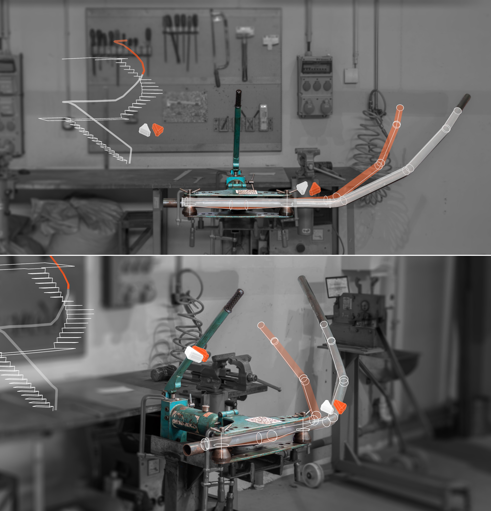
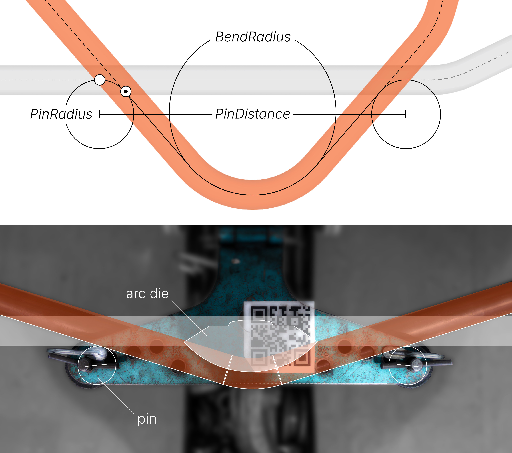
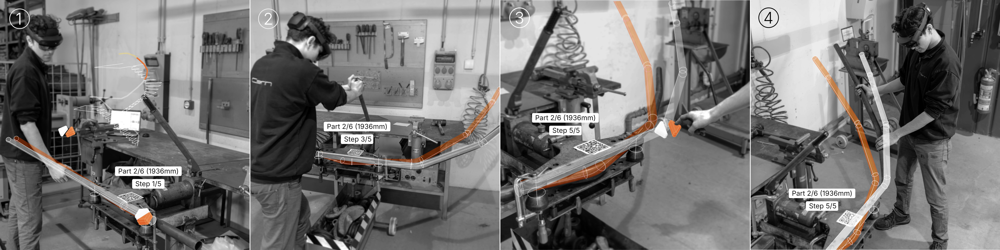

A ready-to-use Rhino3D Grasshopper definition for AR/MR/XR-assisted (via Fologram) pipe bending using a ram-type bending machine, commonly found in metal workshops.

*extended bending machine setup*

# Features

- Segment any curve into a bend-able geometry under the given tool constraints.
- Simulate bending sequence.
- Use interactive XR/AR/MR interface for
	1. XR-marker based alignment, basic tool calibration and reference edges to detect misalignment between virtual and physical space.
	2. selecting part and bending steps.
	3. display of current step and progress for multi-part assemblies.
	4. overlay of starting and resulting geometry for each bending step for visual alignment (especially useful for consecutive non-planar bends).

# Getting Started

## Dependencies

- Rhino 7 or above
- [Fologram](https://fologram.com/) for Rhino3D and Grasshopper (install via PackageManager in Rhino)
- MR-headset with support of Fologram (Hololens 1, Hololens 2, Quest 3) strongly recommended

## Setup

1. Clone directory.

2. Print XR-marker and fixate visibly on top of the bending machine, so that it is well within your view when operating the bending machine. (Hololens and mobile devices only)

3. Measure bending machine parameters for given pipe diameter and set as constants for the definition.
	- PinDistance : The distance between the centrepoints between the two support pins.
	- PinRadius : The distance between neutral fibre of the workpiece pipe and the pin centrepoint it rotates around. This is best determined by clamping the pipe (with diameter $d_Pipe$) to the pins by starting a bend and using a caliper to measure the distance $x$ between pipe and pin outsides. To get an accurate measurement, we place one flank of the caliper on the outer quadrant of the pipe and the other on the opposing quadrant of the pin. As the pins commonly feature a concave or cone geometry to accommodate a range of pipe diameters, we need to measure its smallest diameter $d_Pin$. We then calculate the $PinRadius$ parameter for the definition:  $PinRadius = x - \frac{d_Pin - d_Pipe}{2}$
	- BendRadius : The arc radius for the neutral fibre of the bent pipe piece. This is defined by the arc-die used, but ideally its exact value is validated by a few test bends.

4. Adjust values for offset and base plane rotation until the virtual reference line aligns with the corresponding front edge of the bending machine. (If your bending machine does not feature a front edge parallel to the line spanned by the two pins, find another feature with a known relation to the bending tool and replace the reference line with that instead.)

5. Create a test/benchmark piece to validate calibration and to compare target geometry to resulting bent pipe.

*bending machine parameters*

# Usage

1. Either manually create a bendable pipe geometry centerline curve (polyline with constant arc diameter and minimum distance between bends based on pin distance) or use first cluster to create them automatically from any input curve.

2. Optionally, divide the bendable parts into multiple subparts by either defining a part count, a target segment (bend) count per part or set breakpoints as referenced points.

3. Simulate entire bend sequence for each part. It is recommended to model the environment (at least bending machine and ground) to look for potential collisions. If necessary adjust the part geometry, segmentation or division into subparts accordingly.

4. Follow the bend sequence step-by-step:
	1. Select part by index and select first step.
	2. Position the pipe in the bending machine using the white overlay of the pipe.
	3. Carefully apply pressure to the ram, until the physical pipe matches the orange overlay.
	4. Slightly overshoot the target geometry to account for springback.
	5. Reduce the pressure until the workpiece becomes loose, then slightly increase the pressure until the workpiece is clamped again.
	6. Compare resulting bent pipe geometry with orange pipe geometry and repeat bending if necessary.
	7. Select next bending step and repeat process.

5. Compare finished workpiece to target geometry to evaluate accuracy and adjust parameters if needed.

*bending sequence*

# Considerations

## Ram-type bending

- Ram-type bending machines are mostly suitable for pipes with high wall thickness. 
- Available arc-dies commonly feature a bend-radius of 3D or 4D ($=4*d_Pipe$).
- The pipe flattens considerably on the outside of the bend, increasingly with higher bend arc angles.
- For pipes with seams, the seam should ideally be oriented around the neutral fibre to avoid rippling artefacts at maximum compression (inside-bend) or elongation (outside-bend).

## XR-interface

- When using a MR-enabled headset or mobile device there will always be a slight and varying misalignment between virtual and physical space, depending on view angle, distance and motion relative to the anchoring XR-marker. Make sure to frequently look at the anchoring XR-marker.
- When working with closed headsets without a transparent display (Quest 3), make sure your environment is safe, do not operate heavy machinery and have a surveilling person present.

# How it works

For modelling a bent pipe (see Usage, step 1) we neglect flattening at the bend and instead only consider the neutral fibre (or centreline). We assume it to be sufficiently represented by a  polyline with arc-segments between adjacent segments, where the arc radius is determined by the arc-die used in the ram bending machine and the arc angle (and therefore angle between line segments) is the variable result of incremental bending. If we look at the neutral fibre of the pipe before and after the bend, it will feature the same length.

For the XR-interface we want a visual overlay of the pipe before and after each bending step. We therefore need to orient the neutral fibre/centerline of the pipe before and after bending relative to the bending machine. 

In ram-type bending, the arc dies pushes the pipe against two support pins on either side. The pipe material is therefore drawn inwards relative to its starting position. The virtual contact point $P_c$ between the pipe's neutral fibre and the support pin thereby rotates along the circumference of a circle with radius $PinRadius$. 

Using the bending machine and workpiece parameters (see Setup, step 3) we can calculate the starting and end position of the pipe relative to the support pins for a given target bend angle. We can then orient the virtual bent pipe model (neutral fibre/centreline) accordingly.

# Contributing

Contributions are welcome. Please submit a pull request or open an issue to discuss any changes or improvements.

## Tasks

- [ ] revise bend calculation to account for shift of neutral fibre (due to flattening of the pipe)
- [ ] create calibration system to fine-tune bending behaviour for each material (pipe) type

# License

This work is licensed under a [Creative Commons Attribution-NonCommercial-ShareAlike 4.0 International License](http://creativecommons.org/licenses/by-nc-sa/4.0/).

# Acknowledgement

This [project](https://www.uni-weimar.de/b-a-d.cloud/en/spacecurvestudio) was developed together with Xiangyu Su during a semester project (degree Product Design, Bachelor) at the professorship Emerging Technologies and Design, supervised by Jun.-Prof. Dr. Thomas Pearce and Philipp Enzmann.

